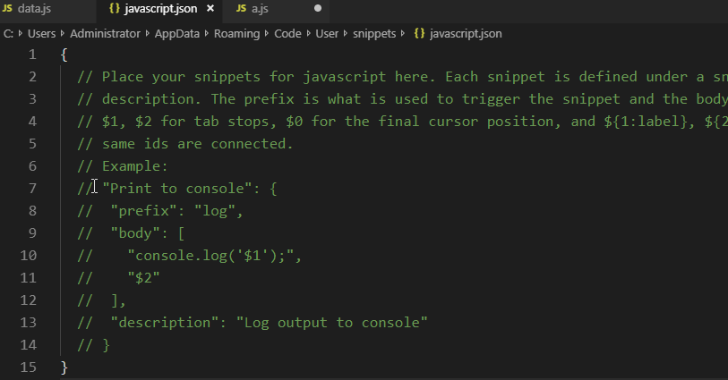
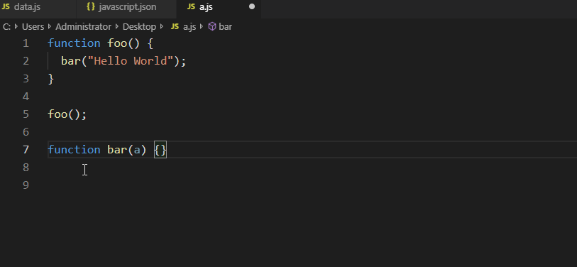
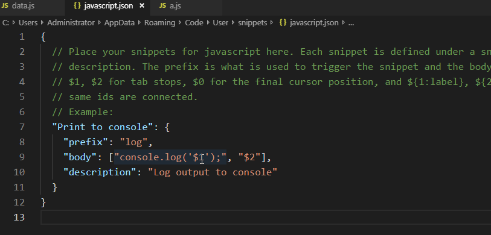
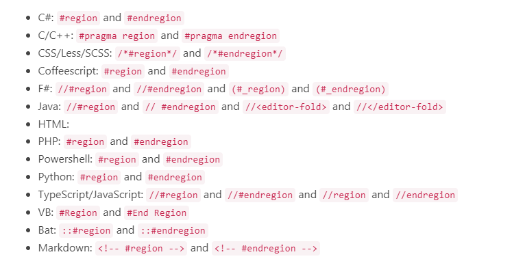
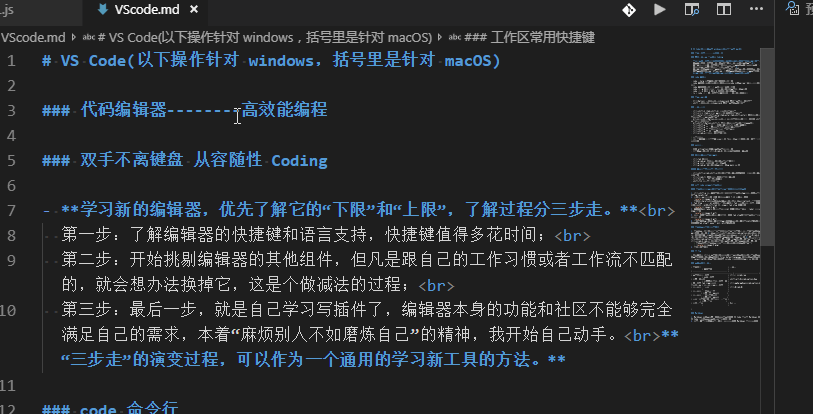
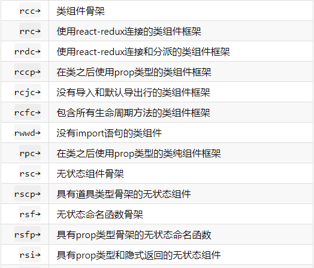

# 玩转VS Code
(以下快捷键操作针对 windows，括号内是针对 macOS)
### 代码编辑器--------高效能编程

- **学习新的编辑器的方法：** 
  第一步：了解编辑器的快捷键和语言支持，快捷键值得多花时间； 
  第二步：开始挑剔编辑器的其他组件，但凡是跟自己的工作习惯或者工作流不匹配的，就会想办法换掉它，这是个做减法的过程； 
  第三步：最后一步，就是自己学习写插件了，编辑器本身的功能和社区不能够完全满足自己的需求，本着“麻烦别人不如磨炼自己”的精神，我开始自己动手。 **“三步走”的演变过程，可以作为一个通用的学习新工具的方法。下面是我整理VS Code常用快捷键和一些超好用的插件（一些常用的插件就没有整理哦）。**

### code 命令行

- code --help 打印命令行所支持的所有参数。
- code 命令后加上文件或文件夹的地址，vscode 会在一个新窗口打开这个文件或文件夹
- code 命令后添加参数-r 可以进行窗口的复用。
- code -r -g 文件名：行数 打开某个文件并自动跳到某一行。
- code -r -d 文件 1 文件 2 比较两个文件的内容
- ls | code -r - 在编辑器里显示当前项目目录下所有的文件名

### 基本键盘操作

- Ctrl(Option) 键搭配方向键，home，end 主要是针对光标的移动；
- shift 键搭配方向键，home，end 主要是针对文本的选择；

### 快捷键进阶

- ctrl+shift+k (Cmd+shift+k) 删除当前代码行；
- ctrl+x/c/v (Cmd+x/c/v) 剪切/复制/粘贴当前代码行；
- ctrl+enter/ctrl+shift+enter(Cmd+enter/Cmd+shift+enter) 在当前行的下面或者上面开始一段新的代码；
- Alt+上下方向键(Option+上下方向键) 上下移动当前行。如果同时按住 shift，则是上下复制当前行；
- Alt+shift+f(Option+shift+f) 对整个文档进行格式化(插件也可以);
- ctrl+shift+p —— 转置游标处的字符(ctrl+t) 调换字符位置;
- ctrl+shift+p —— 转换为大写/小写 调整字符大小写；
- ctrl+shift+p —— 合并行(ctrl+j) 合并代码行;
- ctrl+shift+p —— 按升/降序排列行;
- ctrl+u(cmd+u)撤销光标的移动和选择;

> ==小技巧==
> (1).批量重命名:选中变量/方法名,按 f2，编辑新名字。所有相关的实例名字都会被修改。

### ！多光标

- 按住 alt(option)点击，可以创建多个光标。
- 选中第一个后，按 ctrl+D(cmd+D) 处理多次出现的相同内容。

### 文件，符号，代码之间跳转

- ctrl+tab 文件跳转
- ctrl+p(cmd+p) 最近打开文件的列表，支持搜索
- ctrl+g 行跳转，直接输入行数即可。
- ctrl+p(cmd+p) 某个文件某一行跳转。eg:main.js:99

##### 符号：类定义，函数定义等等

- ctrl+shift+o(cmd+shift+o)当前文件里所有符号。在@后输入：会将所有符号进行分类。
- ctrl+t(cmd+t) 在所有打开的文件中搜索符号。
- ctrl/F12 跳转到函数定义的位置
- shift+f12 打开函数引用预览

### 书写 code snippet(代码片段)

#### 代码片段：将一段常用代码抽象成模板。直接调用即可。

1. ctrl+shift+p 打开命令面板，搜索“配置用户代码片段”回车打开。在列表选择语言；eg:JavaScript
2. 这时打开一个下图的 JSON 文件，我们把 7-14 行取消注释。
   
   必须要有“prefix”前缀和“body”内容这两个属性.“description”不是必须的。
3. Tab Stop -------$1,$2。意思是当我们按下 Tab 键之后，光标移动到的位置。默认移到\$1。shift+tab 移到上一个 tab stop 的位置。
   
4. 占位符。${1:label},在这个格式下，$1 的位置处会预先填入 label 这个值，并且选中。
   
5. 多光标。在代码片段的多个位置使用同样的 tab stop。使用代码片段是就会出现多个光标。
   
6. 预设变量。eg：在某个位置使用剪切板的内容，那个位置写上$CLIPBOARD就可以了。放在tab stop中 语法是 ${1:\$CLIPBOARD}。

### 代码折叠，小地图，面包屑

1. 代码折叠不用说了，就是通过控制每段代码块前面的+/-，来实现代码的折叠。说一下它的快捷键。 折叠：ctrl+shift+左方括号(cmd+option+左方括号),当前光标所处的最内层，可以被折叠的代码就会被折叠起来;ctrl+k,ctrl+0(cmd+k,cmd+0),当前文件里所有可以被折叠的代码一次性全部折叠起来。 展开：ctrl+shift+右方括号(cmd+option+右方括号),展开最内层，可以被展开的代码块；ctrl+k,ctrl+j(cmd+k,cmd+j),当前文件里所有可以被展开的代码一次性全部展开。
   > 基于语言定义代码折叠：(通过下图的方式包裹要折叠的代码块)
   > 
2. 小地图和面包屑

### 小 Tip

> 当我们按下 ctrl+n,新建文件时，默认的就是普通文本文件，没有合适的语法高亮和自动补全。这时我们可以设置 files.defaultLanguage 设置为你想要的语言，比如 javascript。这样新建文件的时候 vscode 就会把它当做一个 js 文件。

### 工作区常用快捷键

| 实现效果                           | 快捷键                                    | 命令面板                |
| ---------------------------------- | ----------------------------------------- | ----------------------- |
| 创建出多个编辑器                   | ctrl+\ （cmd+\）                          | 拆分编辑器              |
| 切换布局方向                       | shift+alt+0（cmd+option+0）               | 切换垂直/水平编辑器布局 |
| 在编辑器 tab 之间进行跳转          | ctrl+pgUp/pgDown（cmd+option+左右方向键） | 打开上/下一个编辑器     |
| 打开或者关闭侧边栏                 | ctrl+B(cmd+B)                             |                         |
| 打开或者关闭最左侧活动栏           |                                           | 切换活动栏可见性        |
| 打开或者关闭顶部菜单栏             |                                           | 切换菜单栏              |
| 打开或者关闭最下面的状态栏         |                                           | 切换状态栏可见性        |
| 侧边栏，面板等全部隐藏，进入禅模式 |                                           | 切换禅模式              |
| 退出禅模式                         | Esc 键                                    |                         |

### Markdown

1. 如今 Markdown 已经成为主流的文档书写语言。在 VS Code 中书写 Markdown 时，VS Code 提供了语法高亮和侧边预览的效果。
2. 前面介绍过如何在符号中快速跳转，这个功能在 Markdown 中更加方便。可以通过符号，快速的在不同的章节直接进行跳转。
   
   当然如果你打开了面包屑功能的话，你也可以通过面包屑工具栏跳转。
### 插件整理
1. Auto Close Tag 自动闭合html标签
2. Auto Rename Tag 修改html标签时，自动修改匹配的标签
3. Code Spell Checker 单词拼写检查（课件，命名）
4. Copy Relative Path  获取文件相对路径
5. Bracket Pair Colorizer 使用颜色标识匹配的括号。当你拥有深层嵌套的对象或函数是,这个插件非常有用。
6. GitLens 单击代码行就可以看到编辑它的人，时间，提交的内容。
7. Css Peek 可以在 HTML 中通过 CSS id 或则 class 来定位到其定义。
8. Remove Comments 一键删除当前文件的注释，支持40多种语言。
9. Image preview 实现图片预览功能。
10. Reactjs code snippets  React代码片段。
 
11. cssrem css值转rem。
### 结语
欢迎各位指正和补充，谢谢。