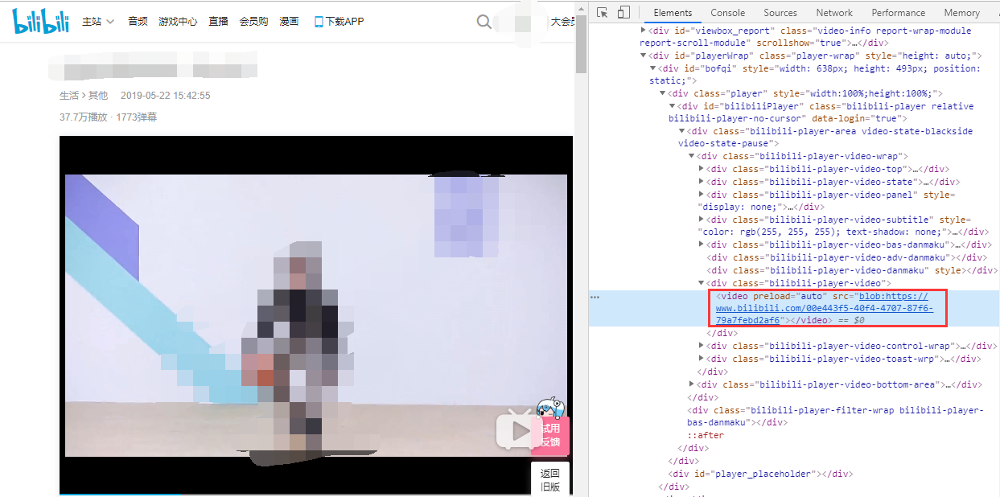
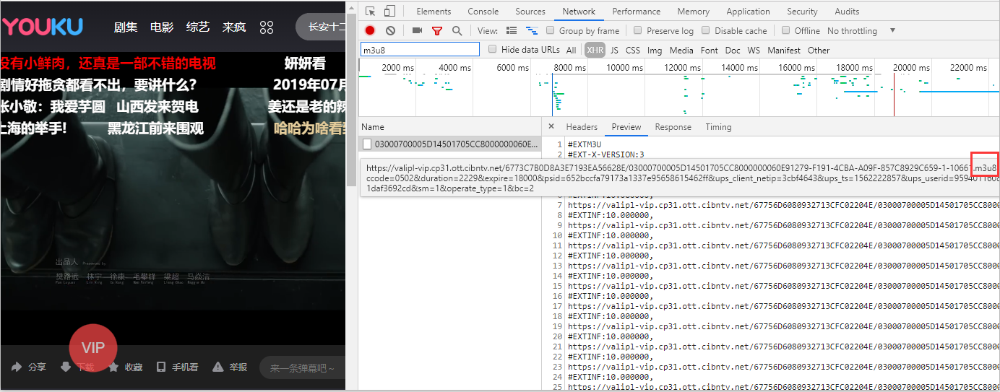
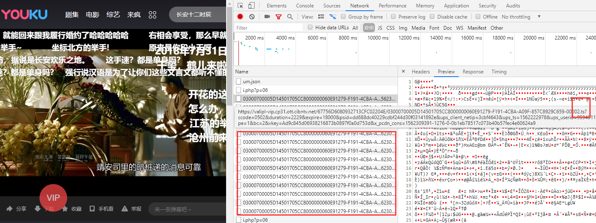
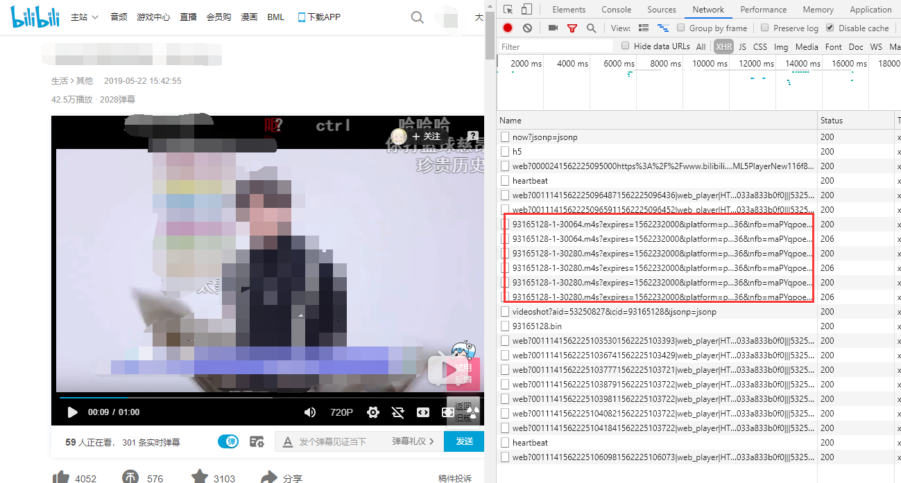

自从HTML5提供了video标签，在网页中播放视频已经变成一个非常简单的事，只要一个video标签，src属性设置为视频的地址就完事了。但以为这里暴露了真实的视频网络地址，所以在早期一般网站的资源文件不怎么通过referer设置防盗链，所以当我们拿到视频的地址后可以随意的下载或使用（当年每次放假回家，就会有亲戚找我帮忙从一些视频网站上下东西）。   

> Tips：目前的云存储服务商大部分都支持referer防盗链。其原理就是在访问资源时，请求头会带上发起请求的页面地址，判断其不存在（表示直接访问图片地址）或不在白名单内，即为盗链。

可是从某个时间开始我们打开调试工具去看各大视频网站的src会发现，它们统统变成了这样的形式。



拿b站的一个视频来看，红框中的视频地址，这个blob是个什么东西？。

其实这个Blob URL也不是什么新技术，国内外出来都有一阵子了，但是网上的相关的文章不多也不是很详细，今天就和大家一起分享学习一下，说不定哪天项目就能用上。

## Blob和ArrayBuffer

我们都知道计算机中的数据是用二进制的方式存储的，所以我们的图片，音视频等，也可以直接以二进制的形式存储，早期数据库就常常用Blob来存储这些二进制数据对象。在web领域，Blob对象表示一个只读原始数据的类文件对象，虽然是二进制原始数据但是类似文件对象，因此可以像操作File对象一样操作Blob对象，实际上，File继承自Blob。

ArrayBuffer对象用来表示通用的、固定长度的原始二进制数据缓冲区（其实就是内存），它不能直接读写，只能通过视图（TypedArray视图和DataView视图)来读写，视图的作用是以指定格式解读二进制数据。Blob可以和ArrayBuffer互相转换。

类型数组对象有以下几个:

- Int8Array：8位有符号整数，长度1个字节。
- Uint8Array：8位无符号整数，长度1个字节。
- Uint8ClampedArray：8位无符号整数，长度1个字节，溢出处理不同。
- Int16Array：16位有符号整数，长度2个字节。
- Uint16Array：16位无符号整数，长度2个字节。
- Int32Array：32位有符号整数，长度4个字节。
- Uint32Array：32位无符号整数，长度4个字节。
- Float32Array：32位浮点数，长度4个字节。
- Float64Array：64位浮点数，长度8个字节。

创建Blob对象并转换成ArrayBuffer：

```javascript
//创建一个以二进制数据存储的html文件
const text = "<div>hello world</div>";
const blob = new Blob([text], { type: "text/html" }); // Blob {size: 22, type: "text/html"}
//以文本读取
const textReader = new FileReader();
textReader.readAsText(blob);
textReader.onload = function() {
  console.log(textReader.result); // <div>hello world</div>
};
//以ArrayBuffer形式读取
const bufReader = new FileReader();
bufReader.readAsArrayBuffer(blob);
bufReader.onload = function() {
  console.log(new Uint8Array(bufReader.result)); // Uint8Array(22) [60, 100, 105, 118, 62, 104, 101, 108, 108, 111, 32, 119, 111, 114, 108, 100, 60, 47, 100, 105, 118, 62]
};
```

创建一个相同数据的ArrayBuffer，并转换成Blob：

```javascript
//我们直接创建一个Uint8Array并填入上面的数据
const u8Buf = new Uint8Array([60, 100, 105, 118, 62, 104, 101, 108, 108, 111, 32, 119, 111, 114, 108, 100, 60, 47, 100, 105, 118, 62]);
const u8Blob = new Blob([u8Buf], { type: "text/html" }); // Blob {size: 22, type: "text/html"}
const textReader = new FileReader();

textReader.readAsArrayBuffer(u8Blob);
textReader.onload = function() {
  console.log(textReader.result); // 同样得到div>hello world</div>
};
```

更多Blob和ArrayBuffer的相关内容可以参看下面的资料：
- [MDN Blob](https://developer.mozilla.org/zh-CN/docs/Web/API/Blob)
- [MDN ArrayBuffer](https://developer.mozilla.org/zh-CN/docs/Web/JavaScript/Reference/Global_Objects/ArrayBuffer)
- [阮一峰js标准参考教程二进制数组](https://developer.mozilla.org/zh-CN/docs/Web/JavaScript/Reference/Global_Objects/ArrayBuffer)


## URL.createObjectURL()

video标签，audio标签还是img标签的src属性，不管是相对路径，绝对路径，或者一个网络地址，归根结底都是指向一个文件资源的地址。既然我们知道了Blob其实是一个可以当作文件用的二进制数据，那么只要我们可以生成一个指向Blob的地址，是不是就可以用在这些标签的src属性上，答案肯定是可以的，这里我们要用到的就是URL.createObjectURL()。

```javascript
const objectURL = URL.createObjectURL(object); //blob:http://localhost:1234/abcedfgh-1234-1234-1234-abcdefghijkl
```

这里的object是用于创建URL的File对象、Blob 对象或者 MediaSource 对象，生成的链接就是以blob:开头的一段地址，表示指向的是一个Blob对象。

其中localhost:1234是当前网页的主机名称和端口号，也就是location.host，而且这个blob地址是可以直接访问的。需要注意的是，即使是同样的二进制数据，每调用一次URL.createObjectURL方法，就会得到一个不一样的blob地址。这个URL的存在时间，等同于网页的存在时间，一旦网页刷新或卸载，这个blob地址就失效。

>Tips: 如果是以文件协议打开的html文件（即url为file://开头），则地址中http://localhost:1234会变成null，而且此时这个blob地址是无法直接访问的。

## 实战一：上传图片预览

有时我们通过input上传图片文件之前，会希望可以预览一下图片，这个时候就可以通过前面所学到的东西实现，而且非常简单。

html
```html
<input id="upload" type="file" />

```

javascript
```javascript
const upload = document.querySelector("#upload");
const preview = document.querySelector("#preview");

upload.onchange = function() {
  const file = fileBtn.files[0]; //File对象
  const src = URL.createObjectURL(file); 
  preview.src = src;
};
```

这样一个图片上传预览就实现了，是不是非常简单，同样的这个方法也适用于上传视频的预览。

## 实战二：以blob地址加载网络视频

现在我们有一个网络视频的地址，怎么能将这个视频地址变成blob形式呢，思路肯定是先要拿到存储这个视频原始数据的Blob对象，但是不同于input上传可以直接拿到File对象，我们只有一个网络地址。

我们知道平时请求接口我们可以使用xhr（jquery里的ajax和axios就是封装的这个）或fetch，请求一个服务端地址可以返回我们相应的数据，那如果我们用xhr或者fetch去请求一个图片或视频地址会返回什么呢？当然是返回图片和视频的数据，只不过要设置正确responseType才能拿到我们想要的格式数据。

```javascript
function ajax(url, cb) {
  const xhr = new XMLHttpRequest();
  xhr.open("get", url);
  xhr.responseType = "blob"; // ""|"text"-字符串（所以我们会拿到一堆乱码字符串） "blob"-Blob对象 "arraybuffer"-ArrayBuffer对象
  xhr.onload = function() {
    cb(xhr.response);
  };
  xhr.send();
}
```

>Tips: 注意XMLHttpRequest和Fetch API请求会有跨域问题，可以通过跨域资源共享(CORS)解决。


看到responseType可以设置blob和arraybuffer我们应该就有谱了，请求直接返回一个Blob对象或者返回ArrayBuffer对象后转换成blob，然后通过createObjectURL生成地址赋值给视频的src属性就可以了,这里我们直接请求一个Blob对象。

```javascript
ajax('video.mp4', function(res){
    const src = URL.createObjectURL(res); 
    video.src = src;
})
```

用调试工具查看视频标签的src属性已经变成一个blob地址，表面上看已经和各大视频网站一样了，但是考虑一个问题，这种形式要等到请求完全部视频数据才能播放，小视频还好说，要是视频资源大一点岂不爆炸，显然各大视频网站不可能这么干。

## HLS和MPEG DASH

HLS （HTTP Live Streaming）, 是由 Apple 公司实现的基于 HTTP 的媒体流传输协议。HLS以ts为传输格式，m3u8为索引文件（文件中包含了所要用到的ts文件名称，时长等信息，可以用播放器播放，也可以用vscode之类的编辑器打开查看），在移动端大部分浏览器都支持，也就是说你可以用video标签直接加载一个m3u8文件播放视频或者直播，但是在pc端，除了苹果的Safari，需要引入库来支持。   

用到此方案的视频网站比如优酷，可以在视频播放时通过调试查看Network里的xhr请求，会发现一个m3u8文件，和每隔一段时间请求几个ts文件。





但是除了HLS，还有Adobe的HDS，微软的MSS，方案一多就要有个标准点的东西，于是就有了MPEG DASH。  

DASH（Dynamic Adaptive Streaming over HTTP） ，是一种在互联网上传送动态码率的Video Streaming技术，类似于苹果的HLS，DASH会通过media presentation description (MPD)将视频内容切片成一个很短的文件片段，每个切片都有多个不同的码率，DASH Client可以根据网络的情况选择一个码率进行播放，支持在不同码率之间无缝切换。   

Youtube，B站都是用的这个方案。这个方案索引文件通常是mpd文件（类似HLS的m3u8文件功能），传输格式推荐的是fmp4（Fragmented MP4）,文件扩展名通常为.m4s或直接用.mp4。所以用调试查看b站视频播放时的网络请求，会发现每隔一段时间有几个m4s文件请求。



不管是HLS还是DASH们，都有对应的库甚至是高级的播放器方便我们使用，但我们其实是想要学习一点实现。其实抛开掉索引文件的解析拿到实际媒体文件的传输地址，摆在我们面前的只有一个如何将多个视频数据合并让video标签可以无缝播放。

## MediaSource

video标签src指向一个视频地址，视频播完了再将src修改为下一段的视频地址然后播放，这显然不符合我们无缝播放的要求。其实有了我们前面Blob URL的学习，我们可能就会想到一个思路，用Blob URL指向一个视频二进制数据，然后不断将下一段视频的二进制数据添加拼接进去。这样就可以在不影响播放的情况下，不断的更新视频内容并播放下去，想想是不是有点流媒体的意思出来了。

要实现这个功能我们要通过MediaSource来实现，MediaSource接口功能也很纯粹，作为一个媒体数据容器和可以和HTMLMediaElement进行绑定，基本流程就是通过URL.createObjectURL创建容器的BLob URL，设置到video标签的src上，在播放过程中，我们仍然可以通过MediaSource.appendBuffer方法往容器里添加数据，达到更新视频内容的目的。

实现代码如下：

```javascript
const video = document.querySelector('video');
//视频资源存放路径，假设下面有5个分段视频 video1.mp4 ~ video5.mp4，第一个初始化为init.mp4
const assetURL = "http://www.demo.com";
//视频格式和编码信息，主要为判断浏览器是否支持，但如果信息和视频不符可能会报错
const mimeCodec = 'video/mp4; codecs="avc1.42E01E, mp4a.40.2"'; 
if ('MediaSource' in window && MediaSource.isTypeSupported(mimeCodec)) {
  const mediaSource = new MediaSource();
  video.src = URL.createObjectURL(mediaSource); //将video与MediaSource绑定，此处生成一个Blob URL
  mediaSource.addEventListener('sourceopen', sourceOpen); //可以理解为容器打开
} else {
  //浏览器不支持该视频格式
  console.error('Unsupported MIME type or codec: ', mimeCodec);
}

function sourceOpen () {
  const mediaSource = this;
  const sourceBuffer = mediaSource.addSourceBuffer(mimeCodec);
  function getNextVideo(url) {
    //ajax代码实现翻看上文，数据请求类型为arraybuffer
    ajax(url, function(buf) {
      //往容器中添加请求到的数据，不会影响当下的视频播放。
      sourceBuffer.appendBuffer(buf);
    });
  }
  //每次appendBuffer数据更新完之后就会触发
  sourceBuffer.addEventListener("updateend", function() {
    if (i === 1) {
      //第一个初始化视频加载完就开始播放
      video.play();
    }
    if (i < 6) {
      //一段视频加载完成后，请求下一段视频
      getNextVideo(`${assetURL}/video${i}.mp4`);
    }
    if (i === 6) {
      //全部视频片段加载完关闭容器
      mediaSource.endOfStream();
    }
    i++;
  });
  //加载初始视频
  getNextVideo(`${assetURL}/init.mp4`);
};

```

这段代码修改自MDN的[MediaSource](https://developer.mozilla.org/zh-CN/docs/Web/API/MediaSource#Browser_compatibility)词条中示例代码，原例子中只有加载一段视频，我修改为了多段视频，由于时间仓促，可能代码有些面条有些难看，就当是为了方便我们看逻辑。

此时我们已经基本实现了一个简易的流媒体播放功能，如果愿意可以再加入m3u8或mpd文件的解析，封装一下，就可以实现一个流媒体播放器了。

最后提一下一个坑，很多人跑了MDN的MediaSource示例代码，可能会发现使用官方提供的视频是没问题的，但是用了自己的mp4视频就会报错，这是因为fmp4文件扩展名通常为.m4s或直接用.mp4，但却是特殊的mp4文件。

## Fragmented MP4

通常我们使用的mp4文件是嵌套结构的，客户端必须要从头加载一个 MP4 文件，才能够完整播放，不能从中间一段开始播放。而Fragmented MP4（简称fmp4），就如它的名字碎片mp4，是由一系列的片段组成，如果服务器支持 byte-range 请求，那么，这些片段可以独立的进行请求到客户端进行播放，而不需要加载整个文件，在DASH（自适应流媒体传输）中推荐使用的就是Fragmented MP4格式，

>关于流媒体协议和视频这块的内容很多，如果感兴趣想要深入了解的可以自行google。

我们可以通过这个网站判断一个mp4文件是否为Fragmented MP4，[网站地址](http://nickdesaulniers.github.io/mp4info/)。

我们通过[FFmpeg](https://ffmpeg.org/)或[Bento4](https://www.bento4.com/)的mp4fragment来将普通mp4转换为Fragmented MP4，两个工具都是命令行工具，安装各自系统下载下来对应的压缩包，解压后设置环境变量指向文件夹中的bin目录，就可以使用相关命令了。

Bento4的mp4fragment，没有太多参数，命令如下:

```shell
mp4fragment video.mp4 video-fragmented.mp4
```

FFmpeg会需要设置一些参数，命令如下：

```shell
ffmpeg -i video.mp4 -movflags empty_moov+default_base_moof+frag_keyframe video-fragmented.mp4
```
>Tips：网上大部分的资料中转换时是不带default_base_moof这个参数的，虽然可以转换成功，但是经测试如果不添加此参数网页中MediaSource处理视频时会报错。

视频的切割分段可以使用Bento4的mp4slipt，命令如下：

```shell
mp4split video.mp4 --media-segment video-%llu.mp4 --pattern-parameters N
```

## 最后

之所以写这篇文章其实是之前公司有个需求让我了解一下Blob URL，稍微看了一下，后来不了了之了，这次忙里偷闲重拾起来把它搞清楚，一边学习一边记录，这篇文章中的很多点展开了其实有很多内容，希望大家看了这篇文章能够有所启发或引起兴趣，我的目的也就达到了，另外视频这方面的东西真的是有点深的，文章中如果有错误和疏漏也欢迎大家指出，我将及时修正。


