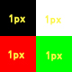
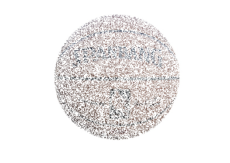
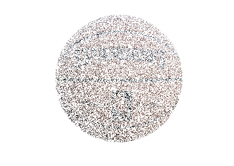
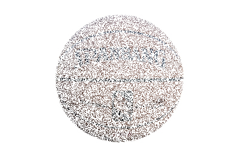

看过复仇者联盟的都知道，灭霸作为计划生育政策的坚定支持者和执行者，一个响指清除了宇宙中二分之一的生命。电影中被清除的生命灰飞烟灭的镜头很是酷炫，所以在复联4上映后，那个不存在的网站google，推出了一个彩蛋，如果在搜索框搜索灭霸，会出现一个手套的按钮，点击后会让网页搜索结果消失一半。

恩~这很谷歌。  
效果虽然酷炫但其实并不复杂，这里带着大家一起来实现一下，网上也已经有了一些教程([Thanos Snap Effect JavaScript Tutorial](https://redstapler.co/thanos-snap-effect-javascript-tutorial/))，这里稍微加点东西，灭霸的响指毕竟是真的打而不是用鼠标点按钮，所以我会加上音量检测，当检测到响指的声音（其实是超过某个音量预值）就触发效果，然后就可以愉快的向朋友装逼了。

### [源代码地址](https://codepen.io/sl2782087/full/OYyLeE)

## 准备开始
我们这里只用一个图片元素,HTML结构如下
```HTML
<body>
     <div class="content">
            <div id="image">
                <!-- 图片为网络地址才可在本地通过直接打开html调试 -->
                
            </div>
    </div>
</body>
```
## 动画的实现   
1. 将html转成canvas，为后面处理做准备。这里我们使用html2canvas库，可以将html中的dom节点绘制成canvas，相当于对这个dom节点进行截图，使用很简单，代码如下（网页生成海报图片就可以用这个库来做）。
```javascript
const imageBox = document.querySelector('#image')
html2canvas(imageBox, {
    backgroundColor: 'transparent' //背景设置为透明
}).then(canvas=>{
    //处理canvas的代码（注意.then这种写法只有在新版本的html2canvas可用）
});
```
2. 这里我们拿到了包含了图片信息的canvas后，要通过canvas的getImageData来获取到canvas画布上的每个像素的信息。
```javascript
 //处理canvas的代码
const ctx = canvas.getContext('2d');
const imageData = ctx.getImageData(
    0,
    0,
    canvas.width,
    canvas.height
);
const pixelArr = imageData.data; //像素信息
```
 图像信息被存储在一个Uint8ClampedArray（8位无符号整型固定数组）中，这个数组中的值为0到255的整数，按图片中像素从左到右从上到下的顺序，每4个数字表示一个像素信息，这4个数字分别表示rgba（r-红色，g-绿，b-蓝色，a-透明度）的四个值。
 比如这样一个图片  
   
 它的像素信息即为
 ```javascript
 [0,0,0,255,255,255,255,255,255,0,0,255,0,255,0,255]
 ```
3. 接下来是最关键的一步，创建多个同等长度的数组，填充上透明像素信息(数组中的值全是0即可)，然后将之前拿到的图像像素信息“随机”分布到这些数组中，这些数组就包含了原图像的部分内容,原教程里面用到了一个随机数生成的库[chance](https://chancejs.com/)来控制随机数出现概率，直接使用完全随机数也没有问题。
```javascript
//创建一个和图像信息数组长度相同的数组并填充0（相当于一个和原图像尺寸相同的透明图像）
const data = pixelArr.slice(0).fill(0); 
//创建透明图像数组的个数，不能太小也不能太大。
const canvasCount = 30;
//将透明图像数组复制多个
const imageDataArray = Array.from({ length: canvasCount }, () =>
    data.slice(0)
);
//将原图像上的像素信息随机分配进不同的透明图象上，位置保持不变
for (let i = 0; i < pixelArr.length; i += 4) {
    const p = Math.floor((i / pixelArr.length) * canvasCount);
    //a为随机选出要放入像素信息的数组
    const a = imageDataArray[Math.floor(Math.random() * canvasCount];
    //将像素信息放入随机到的透明图像数组中覆盖
    a[i] = pixelArr[i];
    a[i + 1] = pixelArr[i + 1];
    a[i + 2] = pixelArr[i + 2];
    a[i + 3] = pixelArr[i + 3];
}
```
当canvasCount为3时效果如下：  
原始图片canvas  
  
生成的包含原图部分像素的3个canvas  
  
  
  
canvasCount越大，生成的canvas越多，分配到每个canvas上面的像素就越少，飘的就越散。  
4. 接下来就非常简单了，隐藏掉原始图像，为生成的canvas添加飘散动画就可以了，飘散动画主要组成就是高斯模糊，位移，旋转，透明度变化，具体代码这里就不写了，可以在demo源代码中看到，最终效果如下。
  

## 响指触发  
灰飞烟灭的动画已经完成，接下来是如何触发这段动画，文章开始就说过谷歌搜索上的原始效果是通过点击按钮触发，而我们通过麦克风实时检测输入音量，当打响指时（音量达到一定大小）触发动画。
1. 首先要确保你的设备有麦克风等声音输入装置，然后监测并获取设备，如果有麦克风设备，网页上会弹出授权提示。
``` javascript
if (navigator.mediaDevices && navigator.mediaDevices.getUserMedia) {
        // 获取用户的 media 信息
        navigator.mediaDevices
            .getUserMedia({ audio: true })
            .then(stream => {
                //音频处理代码
            })
            .catch(error => {
                mystatus.innerHTML = '获取音频时好像出了点问题。' + error;
            });
} else {
        mystatus.innerHTML = '不支持获取媒体接口';
}           
```
2. 音频处理代码
```javascript
// 当输入音量超过此值时，表示检测大音量输入(响指声)
const TRIGGER_VALUE = 0.9; 
// 将麦克风的声音输入这个对象
mediaStreamSource = audioContext.createMediaStreamSource(
    stream
);
// 创建一个音频分析对象，采样的缓冲区大小为4096，输入和输出都是单声道
scriptProcessor = audioContext.createScriptProcessor(
    4096,
    1,
    1
);
// 将该分析对象与麦克风音频进行连接
mediaStreamSource.connect(scriptProcessor);
// 此举无甚效果，仅仅是因为解决 Chrome 自身的 bug
scriptProcessor.connect(audioContext.destination);

// 开始处理音频
scriptProcessor.onaudioprocess = function(e) {
    // 获得缓冲区的输入音频，转换为包含了PCM通道数据的32位浮点数组
    let buffer = e.inputBuffer.getChannelData(0);
    // 获取缓冲区中最大的音量值
    let maxVal = Math.max.apply(Math, buffer);
    // 显示音量值
    if (maxVal > TRIGGER_VALUE) {
        //灰飞烟灭动画
        start(); 
    }
};
```

## 最后
一切搞定，就这么简单可以拿去装逼了，不过我同事问我，只能监测音量大小吗，这样的话不管是咳嗽声，大喊一声，啪啪啪声都可以触发，能不能真的只检测响指的声音。
嗯~这是个好问题，大家一起想想吧。

### 文章列表
- [从模块化到NPM私有仓库搭建](https://juejin.im/post/5c8deb3651882545bb0d0ac7)