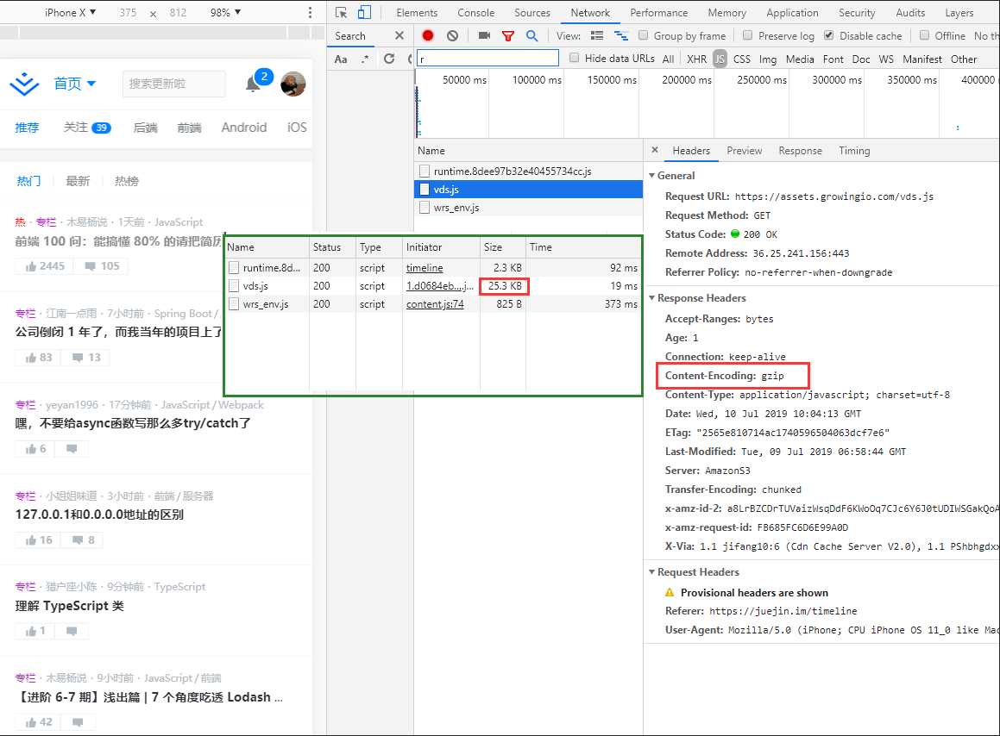
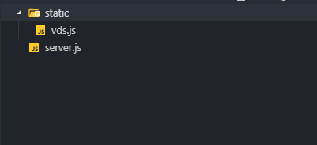
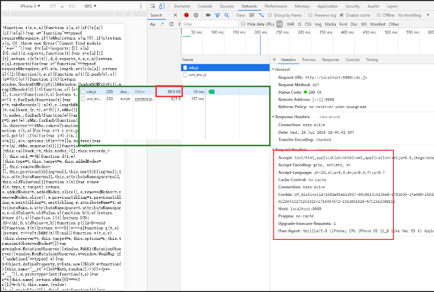
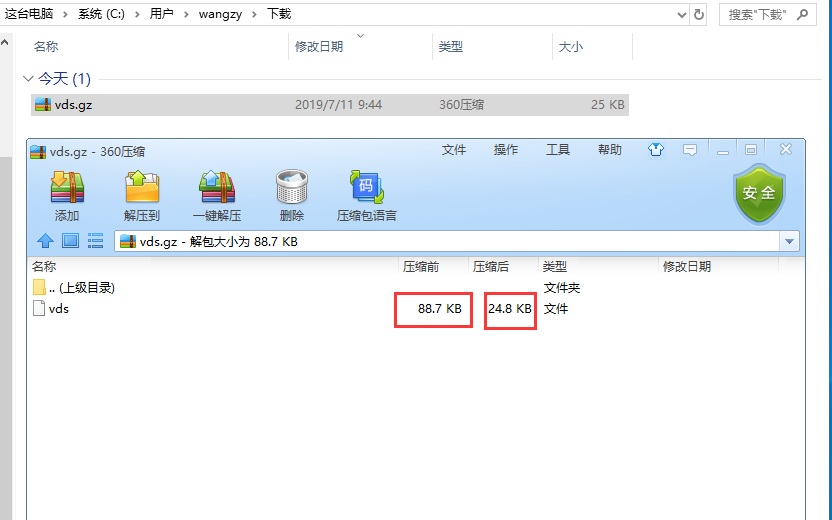

通常在看一些面试题问到前端有哪些性能优化手段的时候，可能会提到一个叫做gzip压缩的方法。正好最近在学习node文件流操作和zlib模块的时候，对gzip压缩有了一个新的认识。今天就和大家一起分享一下，gzip是什么，工作原理。相信看完这篇文章之后，你会不由自主的说，原来gzip是这么个玩意，太简单了。

## 什么是gzip

兄弟你听说winRAR吗？听说过360压缩，快压，好压吗？都听说过，那你听过GNUzip吗？

对，没有错，gzip就是GNUzip的缩写，也是一个文件压缩程序，可以将文件压缩进后缀为.gz的压缩包。而我们前端所讲的gzip压缩优化，就是通过gzip这个压缩程序，对资源进行压缩，从而降低请求资源的文件大小（详细的工作原理，后面会讲到）。

gzip压缩优化在业界的应用有多么普遍呢，基本上你打开任何一个网站，看它们的html，js，css文件都是经过gzip压缩的（即使js，css这类文件经过了混淆压缩之后，gzip仍然可以明显的优化文件体积。）。

```!
Tips：通常gzip对纯文本内容可压缩到原大小的40%。但png、gif、jpg、jpeg这类图片文件并不推荐使用gzip压缩（svg是个例外），首先经过压缩后的图片文件gzip能压缩的空间很小。事实上，添加标头，压缩字典，并校验响应体可能会让它更大。
```

比如现在，你正在访问的掘金，打开调试工具，在网络请求Network中，选择一个js或css，都能在Response Headers中找到 **content-encoding: gzip** 键值对，这就表示了这个文件是启用了gzip压缩的。



## gzip工作原理

上面我们可以看到，这里是掘金网站引入的一个growingIO数据分析的文件，经过了gzip压缩，大小是25.3K。现在我们把这个文件下载下来，建一个没有开启gzip的本地服务器，看看未开启gzip压缩这个文件是多大（其实下载下来就已经能看到文件大小了，是88.73k）。

此处我们用原生node写一个服务，便于我们学习理解，目录和代码如下：



```javascript
const http = require("http");
const fs = require("fs");

const server = http.createServer((req, res) => {
  const rs = fs.createReadStream(`static${req.url}`); //读取文件流
  rs.pipe(res); //将数据以流的形式返回
  rs.on("error", err => {
    //找不到返回404
    console.log(err);
    res.writeHead(404);
    res.write("Not Found");
  });
});
//监听8080
server.listen(8080, () => {
  console.log("listen prot:8080");
});

```

用`node server.js`启动服务，此时我们访问<http://localhost:8080/vds.js>，网页会显示vds.js文件的内容，查看Network面版，会发现vds.js请求大小是88.73k，和原始资源文件大小一致，Response Headers中也没有 **content-encoding: gzip** ，说明这是未经过gzip压缩的。



如何开启gzip呢，很简单，node为我们提供了zlib模块，直接使用就行，上面的代码简单修改一下就可以。

```javascript
const http = require("http");
const fs = require("fs");
const zlib = require("zlib"); // <-- 引入zlib块

const server = http.createServer((req, res) => {
  const rs = fs.createReadStream(`static${req.url}`);
  const gz = zlib.createGzip(); // <-- 创建gzip压缩
  rs.pipe(gz).pipe(res); // <-- 返回数据前经过gzip压缩
  rs.on("error", err => {
    console.log(err);
    res.writeHead(404);
    res.write("Not Found");
  });
});

server.listen(8080, () => {
  console.log("listen prot:8080");
});

```

运行这段代码，访问<http://localhost:8080/vds.js>，会发现网页没有显示vds.js内容，而是直接下载了一个vds.js文件，大小是25k，大小好像是经过了压缩的。但是如果你尝试用编辑器打开这个文件，会发现打开失败或者提示这是一个二进制文件而不是文本。这个时候如果反应快的朋友可能会和我第一次的想法一样，试试把js后缀改成gz。因为前面说了，其实gzip就是一个压缩程序，将文件压缩进一个.gz压缩包。这个地方会不会其实是一个gz压缩包？

不卖关子了，将后缀名改为gz，解压成功后会出来一个88.73k的vds.js。




相信到了这里大家都应该豁然开朗，原来gzip就是将资源文件压缩进一个压缩包里啊，但是唯一的问题是这压缩包我怎么用，我请求一个文件，服务器你却给我一个压缩包，我识别不了啊。

解决这个问题更简单，服务端返回压缩包的时候告诉浏览器一声，这其实是一个gz压缩包，浏览器你使用前先解压一下。而这个通知就是我们之前判断是否开启gzip压缩的请求头字段，Response Headers里的 **content-encoding: gzip**。

我们最后修改一下代码，加一个请求头：

```javascript
const http = require("http");
const fs = require("fs");
const zlib = require("zlib"); 

const server = http.createServer((req, res) => {
  const rs = fs.createReadStream(`static${req.url}`);
  const gz = zlib.createGzip(); 
  res.setHeader("content-encoding", "gzip"); //添加content-encoding: gzip请求头。
  rs.pipe(gz).pipe(res); 
  rs.on("error", err => {
    console.log(err);
    res.writeHead(404);
    res.write("Not Found");
  });
});

server.listen(8080, () => {
  console.log("listen prot:8080");
```

此时浏览器再请求到gzip压缩后的文件，会先解压处理一下再使用，这对于我们用户来说是无感知的，工作浏览器都在背后默默做了，我们只是看到网络请求文件的大小，比服务器上实际资源的大小小了很多。

这一段花了很长的篇幅来将gzip的工作原理，明白之后其实真的很简单，而且以后问到前端性能优化这一点，相信gzip这条应该是不会忘了的。


## gzip的注意点

前面说的哪些文件适合开启gzip压缩，哪些不适合是一个注意点。

还有一个注意点是，谁来做这个gzip压缩，我们的例子是在接到请求时，由node服务器进行压缩处理。这和express中使用compression中间件，koa中使用koa-compress中间件，nginx和tomcat进行配置都是一样的，这也是比较普遍的一种做法，由服务端进行压缩处理。

服务器了解到我们这边有一个 gzip 压缩的需求，它会启动自己的 CPU 去为我们完成这个任务。而压缩文件这个过程本身是需要耗费时间的，大家可以理解为我们以服务器压缩的时间开销和 CPU 开销（以及浏览器解析压缩文件的开销）为代价，省下了一些传输过程中的时间开销。

如果我们在构建的时候，直接将资源文件打包成gz压缩包，其实也是可以的，这样可以省去服务器压缩的时间，减少一些服务端的消耗。

比如我们在使用webpack打包工具的时候可以使用[compression-webpack-plugin](https://www.npmjs.com/package/compression-webpack-plugin)插件，在构建项目的时候进行gzip打包，详细的配置使用可以去看插件的文档，非常简单。


## 最后

gzip的内容并不多，但是感兴趣的朋友可以再去了解下gzip的压缩算法之类的，希望这篇文章对大家理解gzip有所帮助。
