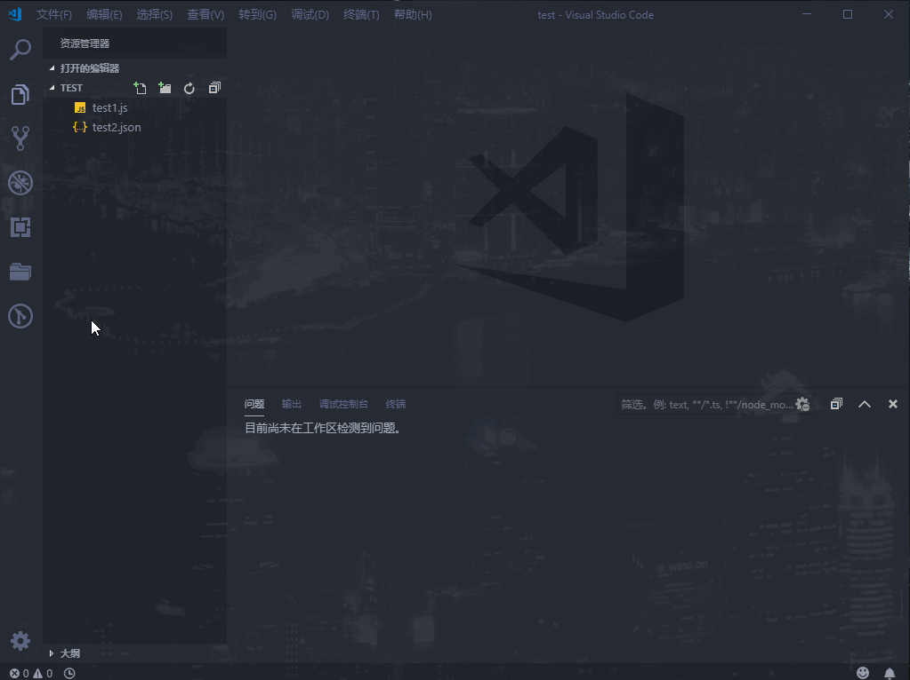
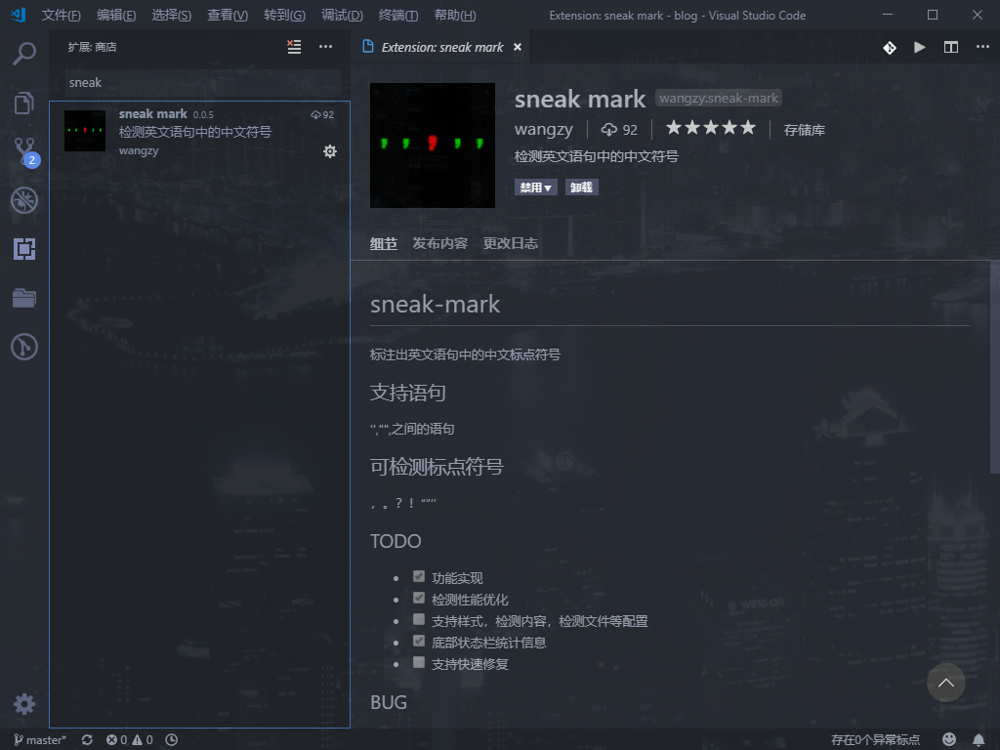
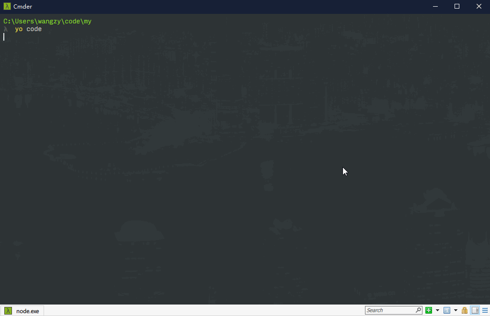
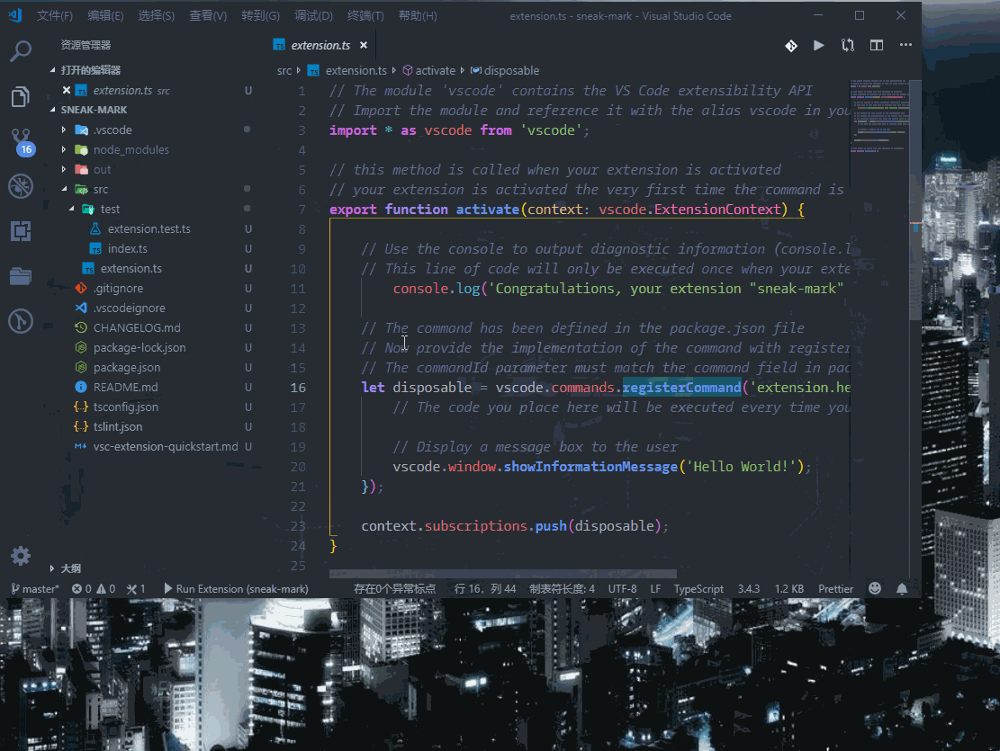
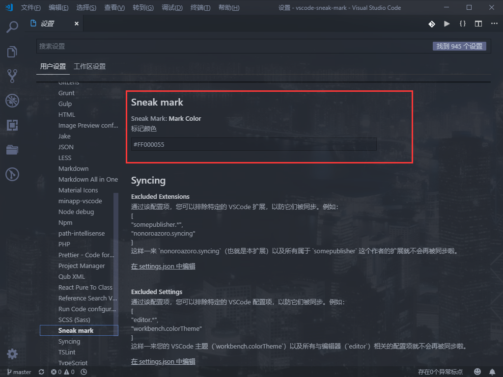

[Visual Studio Code](https://code.visualstudio.com/)（以下简称vscode）是现在非常流行的一款编辑器，相信很多人都在用或者用过，至少也是听说过。不同于[WebStorm](https://www.jetbrains.com/webstorm/)这样的IDE大而全但稍显笨重，vscode算是比较小巧快速的了，虽然还比不上[Sublime Text](http://www.sublimetext.com/)，但是毕竟自带了调试，GIT管理，简单的代码提示等功能，体积大一点也是可以理解的，反正前端开发是比较推荐使用vscode作为首选编辑器的。   
vscode的大部分功能都是通过扩展插件来实现的，安装这些扩展可以给我们提供丰富的功能，但是要注意插件装的越多越吃性能，这点需要大家按照自己的需求和电脑配置去取舍，不是装得越多就越好。   
大部分使用vscode的人都或多或少的使用过如[eslint](https://marketplace.visualstudio.com/items?itemName=dbaeumer.vscode-eslint)（代码检查），[Prettier](https://marketplace.visualstudio.com/items?itemName=esbenp.prettier-vscode)（格式化代码），[GitLens](https://marketplace.visualstudio.com/items?itemName=eamodio.gitlens)（git增强）等必备扩展，讲究一点的人还会选择安装一些代码主题和图标主题。但是我相信很多人只是安装使用，并没有自己开发过扩展插件，今天我就跟大家一起动手开发一个vscode扩展。 
## 需求说明
这里例子是一个工作中真实的需求，由于公司的一个项目中会大量复制粘贴一些文案，在一些英文句子中如果出现了中文标点，写文案的人就会扯皮，说是前端自己写错了（明明都是复制粘贴的），即使找出证据是写文案的错，也会说我们为什么开发的时候没检查出来改掉。秉着前端永不背锅的态度，我决定开发一个扩展来处理这个问题，功能大概就是，检测文件中'' "" ``之间的字符串，纯英文字符串（不出现中文字符）出现了中文标点就标记出来，成品效果如下。   



## 源代码
git地址[https://github.com/hoc2019/vscode-sneak-mark](https://github.com/hoc2019/vscode-sneak-mark)，感兴趣的可以star一波，我会把注释写的尽量详细。vscode商店中搜[sneak mark](https://marketplace.visualstudio.com/items?itemName=wangzy.sneak-mark)也可以找到，目前该扩展基本功能已经完成，后续还会不断更新完善。  



## 准备工作
node环境，如果要发布的话要有一个git仓库和微软账号，编辑器肯定是用vscode,方便调试。因为vscode是基于[Electron](https://electronjs.org/)开发，所以插件也是用Javascript来写（官方更推荐用Typescript），对前端非常友好。   
有人可能会担心太难，其实大可不必，本来我也觉得开发一个扩展很难，但是前段时间vscode出现的[杨超越鼓励师](https://marketplace.visualstudio.com/items?itemName=formulahendry.ycy)和[坤坤鼓励师](https://marketplace.visualstudio.com/items?itemName=sakura1357.cxk)这样的粉丝向扩展，让我觉得扩展开发应该是一个挺随意的事（顺便一提，坤坤鼓励师说明配的那是个什么图和文字，而且搜索关键词竟然有鸡你太美，作者怕是个黑粉）。

## 创建项目
创建项目最简单的方法肯定是使用脚手架，微软官方推出了基于[yeoman](https://yeoman.io/)的脚手架[vscode-generator-code](https://github.com/Microsoft/vscode-generator-code),使用非常简单。（注：yeoman是一个包含了大量脚手架的脚手架仓库）
``` javascript
// 全局安装yeoman和vscode-generator-code
npm install -g yo generator-code

// 创建项目
yo code
```
执行创建命令后，会像使用vue-cli那样有一些配置选项，我这边选择的意思是用ts开发一个新扩展，扩展名为sneak mark,扩展id为sneak-mark。

   

项目已经创建完成，用vscode打开。此时已经是一个简单的扩展，在vscode中按F5(也可以在侧边栏切换到调试面板启动)会启动一个新的vscode运行调试你的代码（标题栏会显示为扩展开发主机），打开命令面版（windows下快捷键是ctrl+alt+p）输入hello world会找一条命令，选中后弹出hello world的提示。  

   

## 项目配置
相关配置是在package.json中，一开始设置的扩展名，扩展id之类的在package.json中都可以修改。我们这里只说明两个重要的配置，还有一些基础的和没用到的配置可以查看[官方项目配置文档](https://code.visualstudio.com/api/references/extension-manifest)。项目配置里面有一项是[扩展配置](https://code.visualstudio.com/api/references/contribution-points)，由于内容比较多而且重要，有单独的页面。如果英文看起来比较吃力，可以先看一下这篇[VSCode插件开发全攻略（三）package.json详解](https://www.cnblogs.com/liuxianan/p/vscode-plugin-package-json.html)（这篇教程里面也有比较全面细致的各项说明）。   
```json
{   
    //启动设置为随vscode打开加载
    "activationEvents": [
        "*"
    ],
    //扩展配置项，最重要的配置点，官方有单独的说明页
    "contributes": {
        //vscode首选项设置里面的相关内容，这里允许用户设置标记的颜色
        "configuration": {
            "type": "object",
            "title": "Sneak mark",
            "properties": {
                "sneakMark.markColor": {
                    "type": "string",
                    "default": "#FF000055",
                    "description": "标记颜色"
                }
            }
        }
    }
}

```
这样配置之后我们的扩展就会随vscode打开加载，不过为了用户的体验，官方不推荐这种加载方式，这样的扩展装多了，就是vscode打开变慢的罪魁祸首。我们应该根据扩展的功能选择最优的加载时机，比如我们这个插件还可以设置为随着打开某种格式的文件加载，比如js和json文件。
```json
{
    "activationEvents": [
        "onLanguage:javascript",
        "onLanguage:json"
    ]
}
```
但是为了以后能检查指定格式文件的功能，这里就先使用随vscode打开加载。   
首选项设置的效果如下，我们可以拿到用户设置的颜色值，作为标记的样式。
   

## 功能实现
微软官方提供了很多扩展的示例，基本上你想做的功能，都有类似的示例（[示例列表](https://code.visualstudio.com/api/extension-guides/overview)和[示例代码](https://github.com/microsoft/vscode-extension-samples)）。  
首先实现异常中文标点的标记高亮，用到的功能示例为[decorator-sample](https://github.com/microsoft/vscode-extension-samples/tree/master/decorator-sample)，流程就是设定一个装饰集，装饰集是一个位置对象数组，vscode的会对装饰集中的位置进行额外样式设置。
```typescript
import * as vscode from 'vscode';
//扩展加载后执行的函数
export function activate(context: vscode.ExtensionContext) {
    //匹配被'',"",``符号包裹的文本
    const textRegEx = /(['"`])[\s\S]*?\1/g;
    //匹配需要标识出的标点符号，计划后期可添加配置
    const charCodeRegEx = /(，|。|‘|’|“|”|？|！)/g;
    //获取配置中异常中文标点的样式
    let sneakDecorationType = getSneakDecorationType();
    //编辑中页面
    let activeEditor = vscode.window.activeTextEditor;
    //更新数据和样式
    function updateDecorations() {
        //获取编辑中页面的文本信息
        const text = activeEditor.document.getText();
        //装饰集（这里就是需要被修改样式的异常中文标点）
        const sneakCharCodes: vscode.DecorationOptions[] = [];
        let match;
        //循环每一个被''""``包裹的异常字符串
        while ((match = textRegEx.exec(text))) {
            const initialText = match[0];
            //字符串中是否包含中文
            const hasChinese = isChineseChar(initialText);
            //字符串中是否含有异常中文标点
            const hasChineseMark = isChineseMark(initialText);
            //若果存在中文或没有中文标点则跳过后续步骤执行下一次循环
            if (hasChinese || !hasChineseMark) {
                continue;
            }
            let charCodeMatch;
            //循环异常字符串中的每一个字符
            while ((charCodeMatch = charCodeRegEx.exec(initialText))) {
                //异常中文标点实际开始位置为异常字符串的位置+异常中文标点在异常字符串的位置
                const startIndex = match.index + charCodeMatch.index;
                const startPos = activeEditor.document.positionAt(startIndex);
                const endPos = activeEditor.document.positionAt(startIndex + 1);
                //异常中文标点的范围
                const decoration = {
                    range: new vscode.Range(startPos, endPos)
                };
                //将异常中文标点的位置添加进装饰集
                sneakCharCodes.push(decoration);
            }
        }
        //激活中的编辑页面应用样式集
        activeEditor.setDecorations(sneakDecorationType, sneakCharCodes);
    }
    //启动时存在打开的编辑页面自动触发样式更新
    if (activeEditor) {
        updateDecorations();
    }
}
```
activate这个函数只会在扩展加载时执行一次，如果存在打开的编辑页面就会标记出异常中文标点，但是后面再打开别的编辑页面或者页面中的内容有修改变化是不会更新的，所以要加两个监听事件来触发。   
```typescript
//防止代码敲的太快，防抖一下
function triggerUpdateDecorations() {
        if (timeout) {
            clearTimeout(timeout);
            timeout = undefined;
        }
        timeout = setTimeout(updateDecorations, 500);
    }
//切换编辑页面事件，会触发样式更新
vscode.window.onDidChangeActiveTextEditor(
    editor => {
        activeEditor = editor;
        if (editor) {
            triggerUpdateDecorations();
        }
    },
    null,
    context.subscriptions
);
//编辑页面中的内容变化，会触发样式更新
vscode.workspace.onDidChangeTextDocument(
    event => {
        if (activeEditor && event.document === activeEditor.document) {
            triggerUpdateDecorations();
        }
    },
    null,
    context.subscriptions
);
```
功能已基本实现完毕，这里只是部分代码和主要功能，完整代码前面给出的github仓库可以看到，基本每一行代码都加了注释，就是为了方便大家理解学习。  
## 发布更新
发布的话有几种形式，可以直接拷贝文件夹给别人，也可以打包成VSIX让别人离线安装，当然最方便的方式还是发布到vscode扩展市场，不过需要先有一个微软账号然后创建令牌token。具体的步骤可以参考[VSCode插件开发全攻略（十）打包、发布、升级](https://www.cnblogs.com/liuxianan/p/vscode-plugin-publish.html)这篇教程。   
这里假设已经有了令牌，接下来的步骤是：
1. 全局安装发布工具
```shell
npm i vsce -g
```
2. 创建发布账号
```shell
vsce create-publisher name
```
这里会需要你设置发布者的账号，之后会提示你输入姓名，邮箱。总得来说和npm包发布很像，不过没有登录密码，而是要填入令牌token。  

3. 发布和更新
```shell
vsce publish
```
注意每次发布package.json中的版本号要有变化。
## 写在最后  
大功告成，你已经有了自己的vscode扩展了，接下来就是去vscode市场欣赏自己的成果，是不是也不是很复杂，而且还很有成就感。   
最后想聊一下，最近在涮掘金的时候，看到一些文章，标题强调作者名字，文章开头github仓库求star，末尾微信公众号求关注，中间内容却随意无比(我竟然看到了一篇内容只是抛出问题，日后github会公布答案的文)，总感觉这些文章动机不纯，带着浓浓的目的性，好像在说我不是来分享的，你们只要关注我就好了，这种风气我觉得不好。   
可能是我酸了，可能将来我分享的时候也带着一些目的，但起码现在我只是在单纯的分享，希望大家喜欢我的文章，多多指正交流。