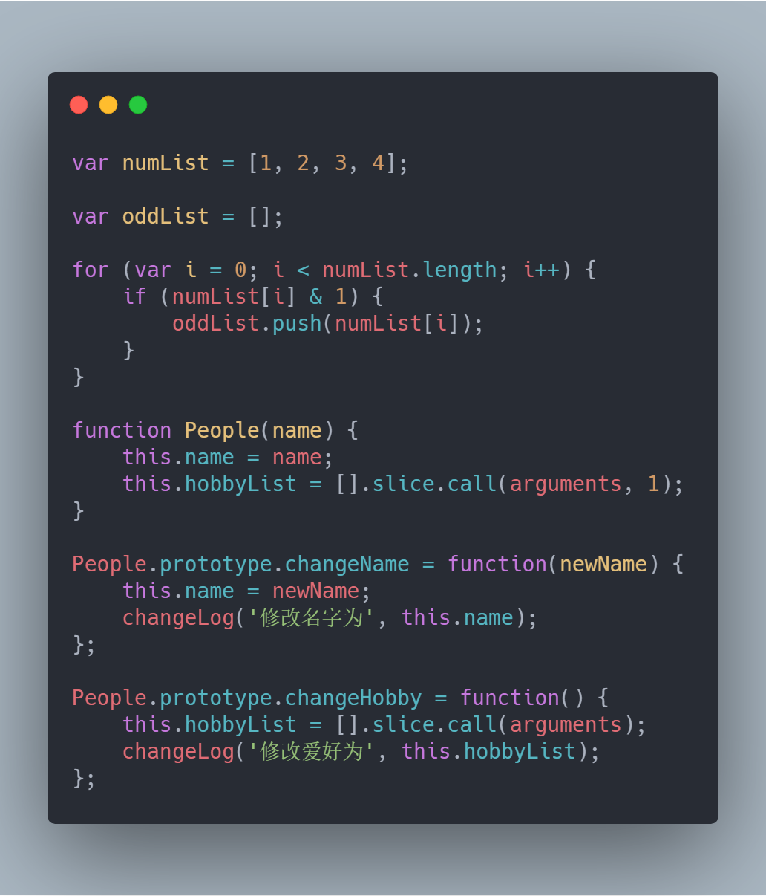
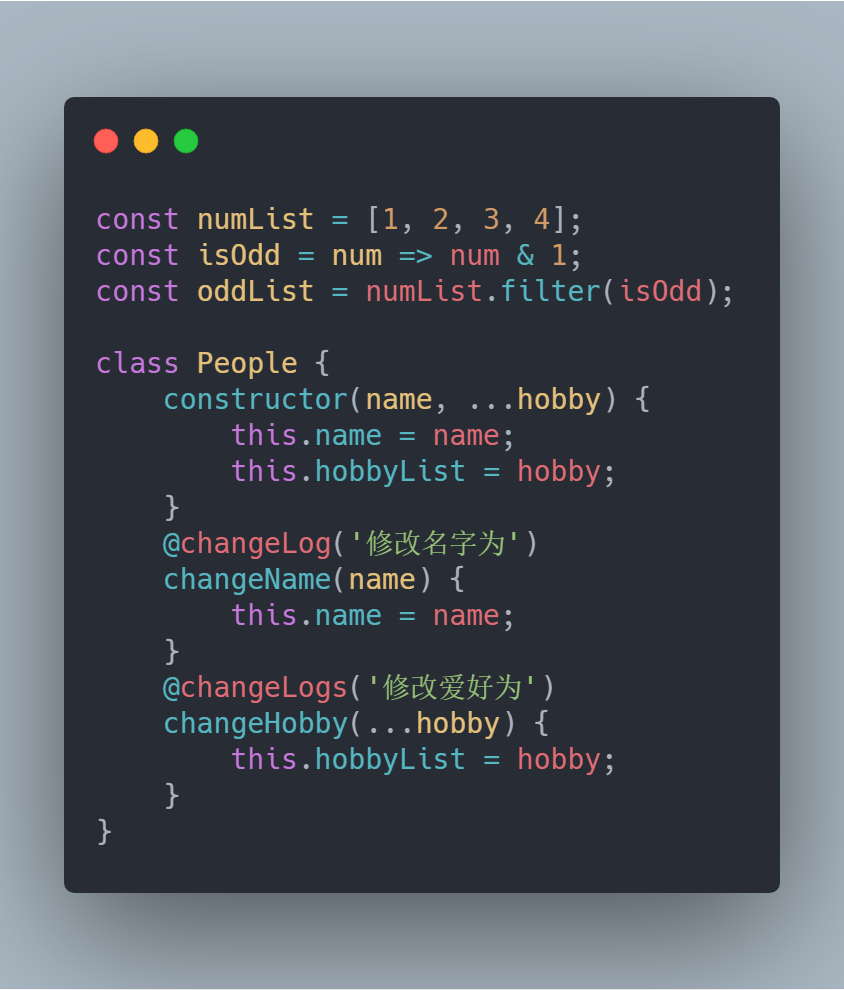

作为程序员应该或多或少都听说过这样一句话，代码首先是写给人看的，其次才是计算机。那么什么样的代码才是人看了会舒服的代码，下面看两份功能相同但是写法风格不同的代码。

  
  

如果让我选一个看着比较舒服的代码，我会毫不犹豫的选第二份。所谓优雅的代码，我认为也无非就是逻辑清晰，结构精炼，风格统一，让人在阅读代码的时候觉得赏心悦目，就好像在看一篇段落分明，语句通顺，字体工整还没什么错别字的作文。

下面就是一些关于写出优雅代码的建议，供大家参考。

## 统一风格

风格统一我认为是很重要的一点，关键词就是这个统一，就好比代码缩进，通常是两到四个空格。一个空格的缩进就会显得比较短，但是如果你的代码中所有的缩进都是一个空格，也比二四空格混用要和谐的多。

```javascript
//一个空格缩进
const people = {
 name:'c',
 hobby:[
  '唱'，
  '跳'   
 ]    
}

//二四空格缩进混用
const people = {
    name:'w',
  hobby:[
      '电',
        '面'  
    ]
}
```

尤其是团队合作项目，使用一个代码风格去约束统一参与者的代码，是快速提高项目代码优雅程度的方法。   

比如我们可以使用[eslint](https://cn.eslint.org/)进行代码风格检查，不仅可以统一风格还能减少一部分错误。

可以自己制定规则，也可以使用现成的代码风格，而且这些代码风格就算不使用，去看一下里面的规则也会有很多收获。

- [Airbnb](https://github.com/airbnb/javascript)代码风格
- [Google](https://github.com/google/eslint-config-google)代码风格
- [Standard](https://standardjs.com/)代码风格
- [AlloyTeam](https://github.com/AlloyTeam/eslint-config-alloy)代码风格（我们公司目前在用这个）

## 函数式编程

函数式编程一直都是很热门的话题，得益于JS中函数是“一等公民”的设定，在JS中


## 链式调用

```javascript
// jquery 
$('.box').addClass('class1').removeClass('class2');

// Promise
promise.then().then().catch();
```

用过jquery和Promise的朋友都知道，我们可以像上面这样进行链式调用，我们也可以把我们自己的方法改成支持链式调用的形式，下面是一个简单的例子。

```javascript
class NumBox {
    constructor(num) {
        this.num = num
    }
    addNum(num){
        this.num += num;
    }
    showNum(){
        console.log(this.num)
    }
}

const nb = new NumBox(1);
nb.addNum(1);
nb.addNum(2);
nb.showNum(); //4

//链式调用改造
class NumBox {
    ...
    addNum(num){
        this.num += num;
        return this;
    }
    ...
}

const nb = new NumBox(1);
nb.addNum(1).addNum(2).showNum(); //4

```

## 类和装饰器


## async/await


## 了解一些设计模式

 策略模式