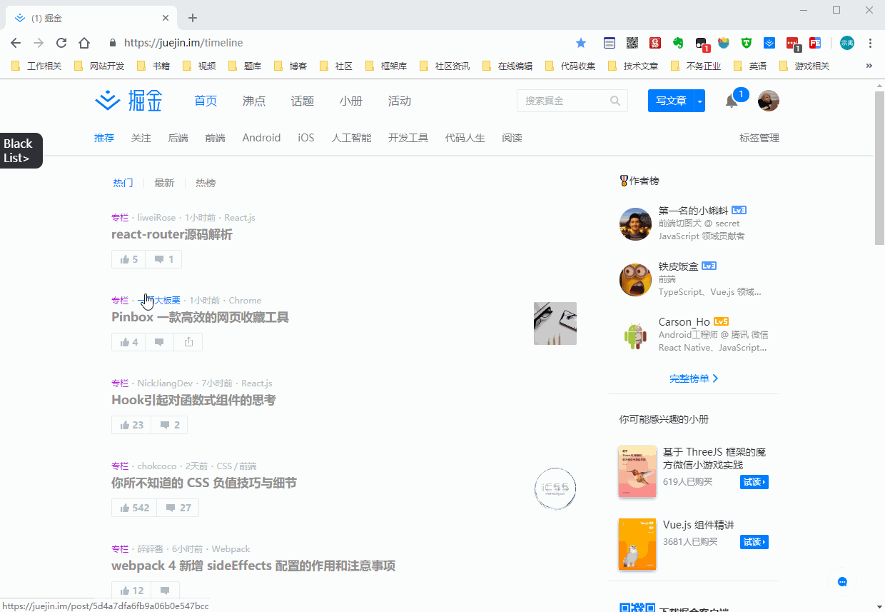
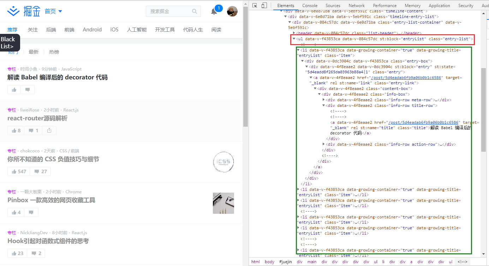
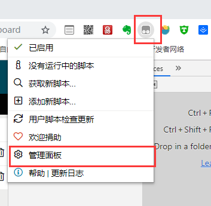
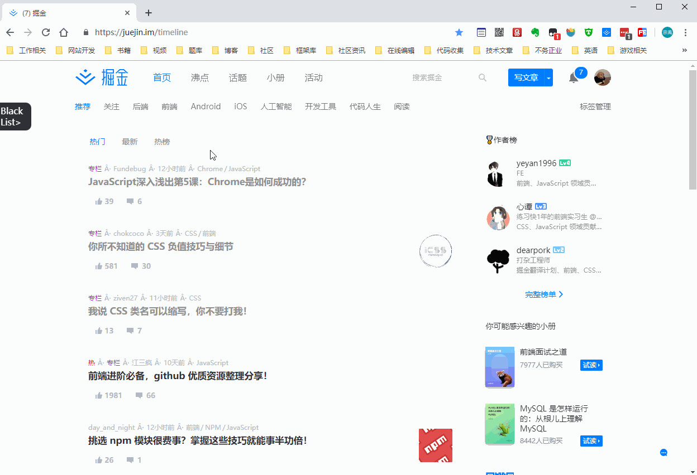
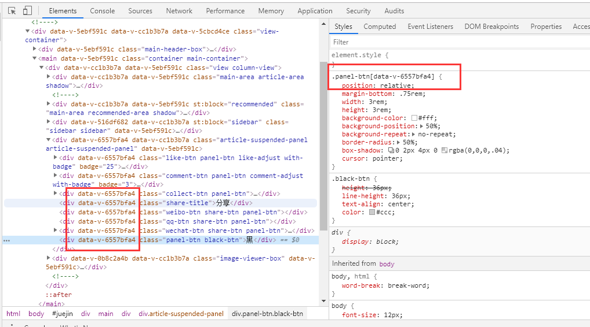

前几天掘金那篇什么挑战前端的文章很火，但是几十的赞几百的评论，说明这篇文章不是火在质量而是火在争议。客观的来讲里面那道题还是不错的，能帮助我们理解js的一些机制。作者评论里面多次提到前端版块文章质量的问题，我想说的是不止前端版块其他版块也一样，任何社区的都不可能保证所有的文章都是精品，只是掘金前端版块文章数量比较多，这个问题比较明显，但是每个读者水平不一样，你觉得这篇讲的东西没什么用，但可能对于别人就很有帮助。

所以就如同评论下面很多人在说希望掘金出一个拉黑屏蔽功能，可以拉黑作者，屏蔽文章。这个功能确实可以满足很多人的筛选文章的需求，但是催这个功能也不是一天两天了，官方可能有自己的计划一直没有提上开发日程。我之前其实没这个需求，顶多就是不太想看面试类的文章，但是那篇文章出来之后，我发现我还是有拉黑需求的，起码那篇文章不应该出现在我的文章推荐列表中。虽然知道官方日后肯定会出这个功能，但是远水解不了近渴，不如当下先自己开发一个插件来实现这个功能。

## 需求说明

1. 将不喜欢的作者加入黑名单，在首页和搜索文章时不再显示黑名单中作者的文章。   
2. 将不喜欢的关键字加入标题黑名单，在首页和搜索文章时不再显示标题中包含关键字的文章。
3. 在文章详情页面可以随时拉黑作者。
4. 可以对黑名单列表进行管理（添加和删除）。

## 成品展示

> 特此说明，作者拉黑只是为了展示功能，而且为了效果特意选择了专栏比较多的高等级作者，对两位上镜的作者并无冒犯之意。

作者屏蔽



标题关键字屏蔽


## 方案思路

实现思路其实非常简单，首先要明确的一点是掘金的文章列表是后台请求回的数据，将来官方实现这个功能的时候可以后端直接返回过滤后的结果，也可以前端拿到数据时进行过滤处理再展示。而对于我们外部插件来说没有这个能力，只能通过将已经生成好的页面元素进行隐藏来达到我们的目的。


### 控制台输入代码版

我们先来一个最简单的实现，首先我们打开chrome的调试面板，看一下掘进首页文章列表的html结构：



如图所示所有的文章以`li`标签的形式，放在`class`为`entry-list`的`ul`中，那么我们现在要做的是选中`entry-list`下的所有`li`标签并查找里面的内容，如果存在`css`关键字就隐藏掉这个`li`标签。

```javascript
//$$是大部分浏览器调试控制台都支持的API，等价于document.querySelectorAll，平时开发不能用。
$$('.entry-list>li').forEach(item => {
    //innerText是一个节点及其后代的“渲染”文本内容，判断里面是否包含css，不区分大小写。
    if (/css/i.test(item.innerText)) {
        //符合要求的元素隐藏
        item.hidden = true;
    }
});
```
在控制台输入这段代码，你就会发现文章列表里面的包含css关键字的条目（这个不光是标题）都被隐藏掉了。

但是滚动条下滑后加载的文章还是会显示的，如果想隐藏只能在控制台再运行一遍这个代码。

### 油猴脚本版

我们要做的是一个完整的插件，而不能像上面那样人工手动在控制台输入代码，虽然你写一个完整的插件代码控制台跑也是可以，功能效果其实是一样的，但终究不是长远之计。

首先我们可以把这个功能做成一个浏览器插件，比如根据Chrome的规范和API建立项目开发，最后打包成crx格式的文件，Chrome浏览器就可以本地安装这个插件，或者花点钱成为谷歌开发者发布到谷歌应用商店。

浏览器插件的好处是，可以调用更多浏览器级的API，使用浏览器为原生插件提供的相关功能，但是对于我们只针对一个网站提供的小功能来说，有些杀鸡用牛刀了，而且这个插件也只有Chrome能用，如果其他浏览器想用还要再开发，比如FireFox就使用的是xpi格式的扩展。

一种更好的方式就是使用[Tampermonkey](http://www.tampermonkey.net/)。

Tampermonkey（国内习惯称其为油猴）是一个浏览器插件，是最为流行的用户脚本管理器，而且在 Chrome, Microsoft Edge, Safari, Opera Next, 和 Firefox都有对应的版本，也就是说我们写的脚本可以通过它跑在各个浏览器上。而我们今天就是通过油猴脚本的形式来实现我们的功能。

对浏览器插件开发更感兴趣的朋友推荐这篇文章：[【干货】Chrome插件(扩展)开发全攻略](https://www.cnblogs.com/liuxianan/p/chrome-plugin-develop.html#%E6%89%93%E5%8C%85%E4%B8%8E%E5%8F%91%E5%B8%83)

## 方案实现

### 安装Tampermonkey

Tampermonkey的安装说简单也简单，说不简单也不简单，简单的是Tampermonkey被收录在各个浏览器的官方插件市场，很轻易的就可以搜索下载，而且不仅限于前面提到的那些浏览器，一些移动端浏览器也是支持的，还有虽然Tampermonkey官网没写，但是一些国产浏览器插件市场也是有的，比如360极速浏览器，搜狗浏览器。不简单的原因嘛，就是有些浏览器的插件市场咱们不好访问。

如果浏览器插件市场确实没有，只要是chromium内核的，通常都支持crx本地安装。

安装完成后我们可以在浏览器上点击油猴插件图标，可以在管理面板中查看，开启，删除，管理我们的脚本，可以在获取新脚本中找到几个脚本市场的网站，直接下载别人写好的脚本。




### 创建脚本文件

我们要自己开发脚本的话，选择添加新的脚本就可以打开一个脚本编写页面，但是建议还是在自己编辑器里写，有提示和格式化更方便。

创建后的脚本默认有一些代码如下，就是头部像是注释一样的东西，这里要用到的简单说明一下，更多内容可以参考[官方文档](https://www.tampermonkey.net/documentation.php?ext=dhdg)。

```javascript
// ==UserScript==
// @name         掘金文章黑名单                                 <-插件名，会显示在管理面板里
// @namespace    https://github.com/hoc2019/blackList          <-脚本命名空间
// @version      0.1                                           <-版本号
// @description  掘金文章黑名单过滤脚本                          <-描述
// @author       wangzy                                        <-作者
// @match        https://juejin.im/*                           <-只有匹配到的网站才会使用该脚本
// @require      https://cdn.bootcss.com/jquery/3.4.1/jquery.min.js   <-引入脚本，这里用了jQuery
// @grant        GM_addStyle                                   <-给网站注入css样式的方法
// ==/UserScript==

(function() {
    'use strict';

    // Your code here...
})();
```

### 文章列表过滤 - MutationObserver观察dom节点变化

文章列表的过滤隐藏和上面控制台输入代码版原理差不多，重点是触发隐藏操作的时机。由于数据异步请求，过早的话文章列表dom节点还没有被创建，过滤操作就会失败，而过晚的话就会肉眼可见列表的消失。

一个简单粗暴的方式就是写一个轮询，不断的去检测文章列表dom节点是否存在，存在则表示文章加载完成，可以进行过滤操作了。同理滚动到底部加载文章，也可通过轮询检测文章列表dom节点数量是否改变来触发过滤操作（当然也可以检测滚轮事件）。但是轮询本身就是一个在性能和体验上找平衡的方法，轮询间隔短了判断就准确，体验就好，但是会消耗很多性能，反之则性能好，体验就差。

所以这里我们使用MutationObserver，MutationObserver可以用来监听DOM节点的变化，是旧的Mutation Events功能的替代品，详细内容可以参考MDN的[文档](https://developer.mozilla.org/zh-CN/docs/Web/API/MutationObserver)。

大概的使用方式如下：

```javascript
const container = $('#juejin');
const config = {
    attributes: false,      // 检测节点属性变化，这里用不到，为减少不必要的触发这里不用开启
    childList: true,        // 检测子节点添加和删除
    subtree: true           // 检测包含后代节点
};
const mutationCallback = mutationsList => {
    for (let mutation of mutationsList) {
        const type = mutation.type;
        const addedNodes = mutation.addedNodes;  //增加节点数组
        // 会根据上面的的设置触发相应事件，这里可以判断触发的事件类型
        switch (type) {
            case 'childList':
                //因为我们是要判断列表加载，只用处理节点增加时的事件即可
                if (addedNodes.length > 0) {
                    list = $('.entry-list');
                    if (list.children().length) {
                        //停止观察
                        loadObserver.disconnect();
                        //过滤操作
                        filter(list.children());
                        //创建滚动后加载观察
                        createNodeListener(list[0], config, updateLoad);
                    }
                }
                break;
        }
    }
};
//创建首次加载观察
const loadObserver = createNodeListener(container[0], config, handleLoad);
//定义一个创建观察者的工厂函数，方便创建观察者。
function createNodeListener(node, config, mutationCallback) {
    const observer = new MutationObserver(mutationCallback);
    observer.observe(node, config);
    return observer;
}
```

这里可能会有疑问为什么中间要重新创建一个新的观察，因为一开始的观察是基于一个非常顶层的容器（id为juejin的div节点，一开始只有它存在），文章列表之外的一些其他DOM节点变化也会触发事件，所以当我们拿到文章列表的容器后（class为entry-list的ul），就停止对顶层容器的观察改为只观察文章列表容器，这样我们就可以精确的只响应文章列表节点的变动。

```!
通过MutationObserver构造函数创建完观察者后不会立即启动观察，需要通过观察者者调用observe方法，需要注意的是observe方法的第一个参数必须是DOM Node (可能是一个Element) ，通过jQuery获取的节点要转化为原生dom节点，例如$('#juejin')[0]这样。
```

### 黑名单数据的保存 - localStorage数据存取

黑名单数据存储在localStorage，一个即使页面关闭也可以长期保留数据的方式，具体内容可以查看MDN的[文档](https://developer.mozilla.org/zh-CN/docs/Web/API/Window/localStorage)。

使用方式很简单，但要注意的是localStorage存储的只能是字符串，如果想保存数组和对象需要做一下序列化处理，转成json字符串。

```javascript
//存储
const authorBlackList = ['小四', '小五'];
localStorage.setItem('authorBlackList', JSON.stringify(authorBlackList));

//读取
const authorBlackList = JSON.parse(localStorage.getItem('authorBlackList'));
```
存储后的数据可以打开浏览器调试的Application面板查看，由于是本地保存浏览器清空localStorage就会导致数据清除，跨浏览器也是不能共用数据的，服务端存储的话需要成本，这事还是交给官方来干吧。

### 黑名单管理侧边栏

这个也比较好实现，写好html，通过jQuery创建节点插入页面就可以了，css样式的话要通过油猴脚本提供的方法GM_addStyle插入，前面有提到过。

大概就是下面这个样子：

```javascript
//css样式
const myScriptStyle ='.black-sidebar{background:#000}'
GM_addStyle(myScriptStyle);

//html结构
const sidebarHtml = '<div class="black-sidebar"><ul><ul></div>';
$('body').append($(sidebarHtml));
```

可能唯一注意的点就是侧边栏中黑名单列表是后期可以动态添加的，所以点击事件不能直接通过jquery的click方法绑定在生成的`li`标签上，而是要通过on方法绑定在父级`ul`上，就和事件委托一个道理。不过这些都是jQuery的用法注意点，不知道新入行的朋友还会不会用到。

### 不同页面侧边栏数据同步 - visibilitychange事件监听

黑名单管理侧边栏是一开始就生成的，虽然当前页的操作会更新到侧边栏，但是通常在浏览过程中我们是打开多个页面的，那我们要如何保持多个页面侧边栏的数据同步呢？显然跨浏览器标签页操作dom是不现实的，但是我们可以去监听一个标签页的切换，当该标签页为显示状态时，重新获取一下数据并更新列表。

我们通过visibilitychange事件来监听，该事件详情可以参考MDN[文档](https://developer.mozilla.org/zh-CN/docs/Web/API/Document/visibilitychange_event)。

```javascript
document.addEventListener('visibilitychange', function() {
    if (document.visibilityState === 'visible') {
        // 更新侧边栏数据
        updateSidebarList();
        if (pathname === 'post') {
            //如果是详情页，更新拉黑按钮状态
            updateBtnState();
        }
    }
});

```

效果如下：


```!
上面document.visibilityState是只读属性表示标签页状态，visible表示显示，还有hidden表示隐藏。所以通过该方法还可以检测到标签页的隐藏，移动端浏览器切换到后台s，媒体声音还在继续播放的问题，可以通过这个事件手动暂停解决。
```

### 文章详情页拉黑按钮

这个也很简单，不过在做的时候碰到一个有意思的地方，本来想着创建一个和上面分享按钮一样的元素，添加同样的类名就可以了，结果没想到掘金的样式里类选择器还带了应该是控制版本的一个数据，不能直接使用因为以后可能是会变，解决方式就是克隆了一个分享按钮的节点，再对内容作了修改。



## 最后

这个插件基本功能已经完成，但是由于开发的时候目的就是为了自用，没有考虑兼容性，也没有各种情况下的测试，只是自己跑通能用就行。  

其实还是很多点可以优化，比如现在添加删除黑名单后要页面刷新才能生效，一些dom操作还可以减少，代码可以进一步抽象封装，面向对象等等。所以这篇文章的目的并不是推广这个插件，而是简单的分享一下脚本的开发流程，和里面解决某些问题的思路，能引起某些人关于脚本开发的兴趣就足够了，这也是这个系列文章的目的。  

这个脚本的代码我会放到Github，有需求的可以用用试试，但是后续还没有什么更新计划，bug随缘修复，感兴趣的可以参与共同维护，在官方出这功能之前，咱们自己动手，丰衣足食。

[脚本仓库地址](https://github.com/hoc2019/blackList)